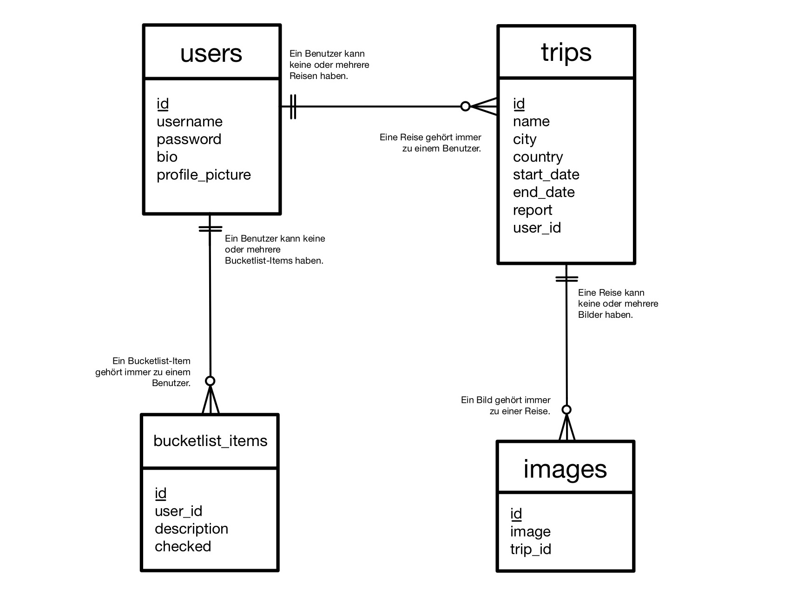

{: .no_toc }
# Data model

{: .text-delta }

Table of contents

+ ToC
{: toc }

[Visualize and describe the data model(s) of your application. This description should match the actual implementation.]

## Overview

TripTiks Datenbank besteht aus mehreren Entitäten, die die Geschäftslogik und die Anwendungsanforderungen widerspiegeln. Das gewählte Modell stellt  dabei sicher, dass die Integrität der Daten bewahrt bleibt, indem Fremdschlüssel verwendet werden, um die Verbindungen zwischen den Entitäten zu verwalten. Die relevanten Tabellen sind dabei folgende:

1. **users**

2. **trips**

3. **images**

---

## Entitäten und ihre Attribute

1. **users**
+ id: Die id ist als Primärschlüssel deklariert und dient der eindeutigen Identifikation des Benutzers.
+ username: Der Benutzername muss eindeutig sein.
+ password: Das Passwort des Benutzers wird als Hash gespeichert, damit es nicht als Klartext, in der Datenbank, lesbar ist..
+ bio: Das Hinzufügen einer Biografie ist für jeden Nutzer optional.

2. **trips**
+ id: Auch hier ist die id der Primärschlüssel, dient jedoch hier der eindeutigen Identifikation der Reise.
+ name: Der Name der Reise, muss eindeutig sein.
+ city: Hier wird die Stadt, in der die Reise stattfindet, gespeichert.
+ country: Wobei hier das Land, in dem die Reise stattfindet, gespeichert wird.
+ start_date: Startdatum der Reise.
+ end_date: Enddatum der Reise.
+ report: Zu jeder Reise kann ein Bericht hinzugefügt werden, der jegliche Erlebnisse und Gefühle des Benutzers widerspiegelt..
+ user_id: Der Fremdschlüssel, verweist auf die `users`-Tabelle und zeigt an, welcher Benutzer die Reise erstellt hat.

3. **images**
+ id: Die id dient als Primärschlüssel und sorgt für die eindeutige Identifikation des Bildes.
+ image: Hier werden die Binärdaten des Bildes gespeichert.
+ trip_id: Dieser Fremdschlüssel, verweist auf die `trips`-Tabelle und ordnet das Bild einer bestimmten Reise zu.

---

## Beziehung zwischen den Entitäten

+ **users und trips:** Ein Benutzer kann mehrere Reisen erstellen, wobei jede Reise einem Benutzer eindeutig zugeordnet ist. Die `user_id` in `trips` verweist dabei auf `id` in `users`.
+ **trips und images:** Eine Reise kann mehrere Bilder enthalten, wobei jedes Bild einer Reise eindeutig zugeordnet ist. Dabei verweist `trip_id` in `images` auf `id` in `trips`.

---

## Entity-Relationship-Diagramm (ERD)

