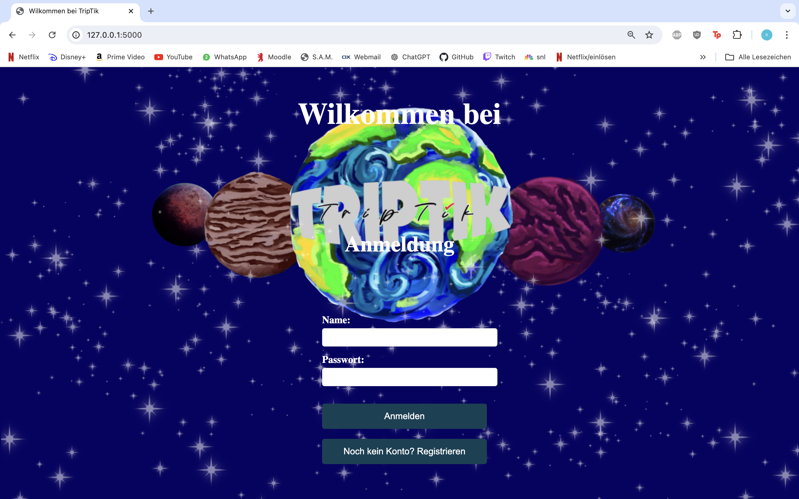
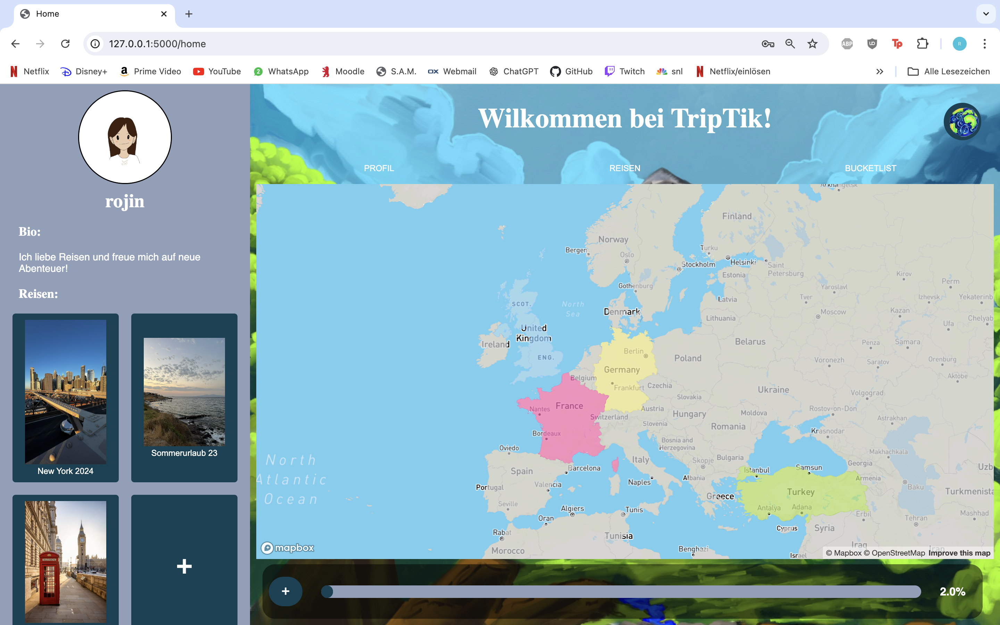
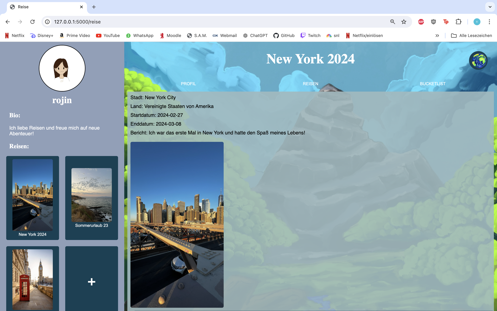
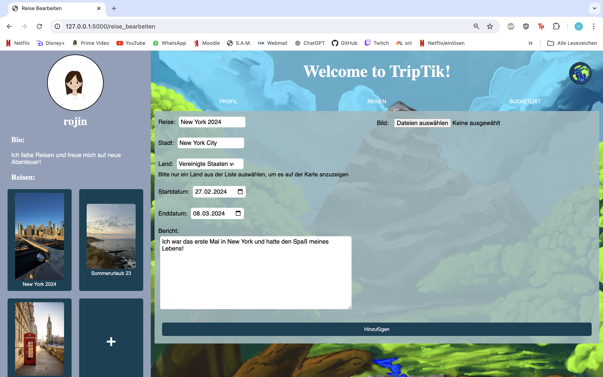
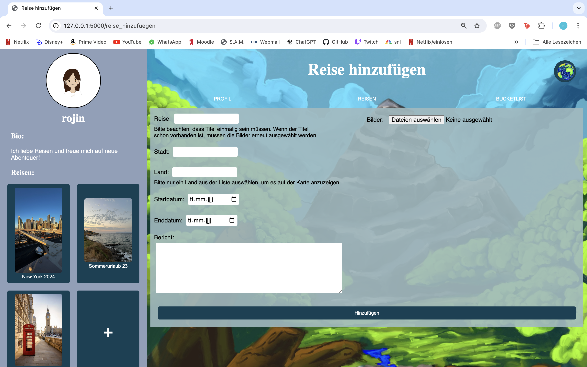
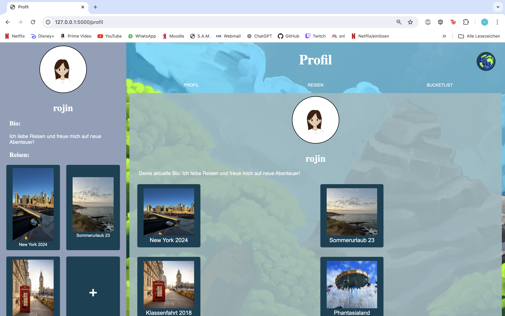
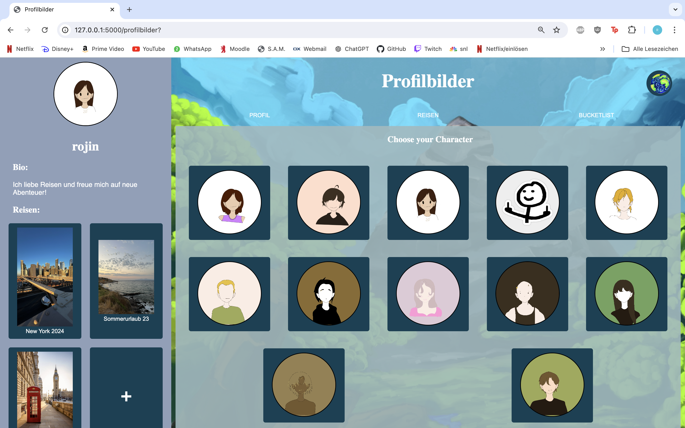
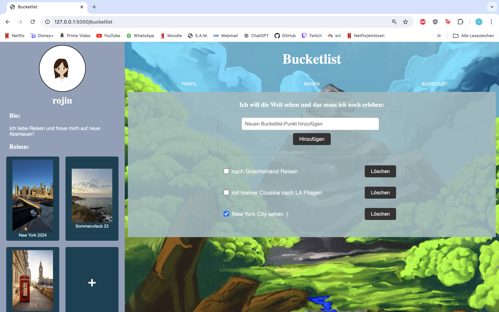

{: .no_toc }
# Reference documentation

## Anmelden und Registrieren

### `index()`
+ **Route:** `/`
+ **Methods:** `GET`, `POST`
+ **Purpose:** Zeigt die Anmeldeseite an.
+ **Sample output:**

### `register_page()`
+ **Route:** `/register-page`
+ **Methods:** `GET`, `POST`
+ **Purpose:** Zeigt die Registrierungsseite an.
+ **Sample output:** 

---

## Startbildschirm anzeigen

### `home()`
+ **Route:** `/home`
+ **Methods:** `GET`, `POST`
+ **Purpose:** Zeigt die Startseite des Benutzers an, sowie Benutzerinformationen, Fortschritt und Reisen.
+ **Sample output:** 

---

## Reisen Anzeigen, Bearbeiten und Hinzufügen

### `reisen_page()`
+ **Route:** `/reisen`
+ **Methods:** `GET`, `POST`
+ **Purpose:** Zeigt die Seite mit den allen Reisen des Benutzers an.
+ **Sample output:** 

### `reise_page()`
+ **Route:** `/reise`
+ **Methods:** `GET`, `POST`
+ **Purpose:** Zeigt die Details einer bestimmten Reise an. Wenn keine `trip_id` angegeben ist, wird eine Fehlermeldung angezeigt.
+ **Sample output:** 

### `reise_bearbeiten_page()`
+ **Route:** `/reise_bearbeiten`
+ **Methods:** `GET`, `POST`
+ **Purpose:** Ermöglicht das Bearbeiten einer bestimmten Reise. Wenn keine `trip_id` angegeben ist, wird eine Fehlermeldung angezeigt.
+ **Sample output:** 

### `reise_hinzufuegen_page()`
+ **Route:** `/reise_hinzufuegen`
+ **Methods:** `GET`, `POST`
+ **Purpose:** Zeigt die Seite zum Hinzufügen einer neuen Reise an.
+ **Sample output:** 

---

## Profil Anzeigen und Bearbeiten

### `profil_page()`
+ **Route:** `/profil`
+ **Methods:** `GET`, `POST`
+ **Purpose:** Zeigt die Profilseite des Benutzers an.
+ **Sample output:** 

### `profil_bearbeiten_page()`
+ **Route:** `/profil_bearbeiten`
+ **Methods:** `GET`, `POST`
+ **Purpose:** Ermöglicht das Bearbeiten des Profils. Bei Fehlern wird eine entsprechende Fehlermeldung angezeigt.
+ **Sample output:** 

### `profilbilder_page()`
+ **Route:** `/profilbilder`
+ **Methods:** `GET`
+ **Purpose:** Zeigt die Profilbilderseite des Benutzers an.
+ **Sample output:** 

### `set_profile_picture()`
+ **Route:** `/set_profile_picture`
+ **Methods:** `POST`
+ **Purpose:** Aktualisiert das Profilbild des Benutzers.
+ **Sample output:** 

---

## Bucketlist Erstellen, Updaten und Löschen

### `bucketlist_clicked()`
+ **Route:** `/bucketlist`
+ **Methods:** `GET`, `POST`
+ **Purpose:** Zeigt die Bucketlist des Benutzers an.
+ **Sample output:** 

### `add_bucketlist_item()`
+ **Route:** `/add_bucketlist_item`
+ **Methods:** `POST`
+ **Purpose:** Fügt einen neuen Punkt zur Bucketlist des Benutzers hinzu.
+ **Sample output:** 

### `update_bucketlist_item()`
+ **Route:** `/update_bucketlist_item/<int:item_id>`
+ **Methods:** `POST`
+ **Purpose:** Aktualisiert den Status eines Bucketlist-Punkts.
+ **Sample output:** 

### `delete_bucketlist_item()`
+ **Route:** `/delete_bucketlist_item/<int:item_id>`
+ **Methods:** `POST`
+ **Purpose:** Löscht einen Punkt von der Bucketlist des Benutzers.
+ **Sample output:** 