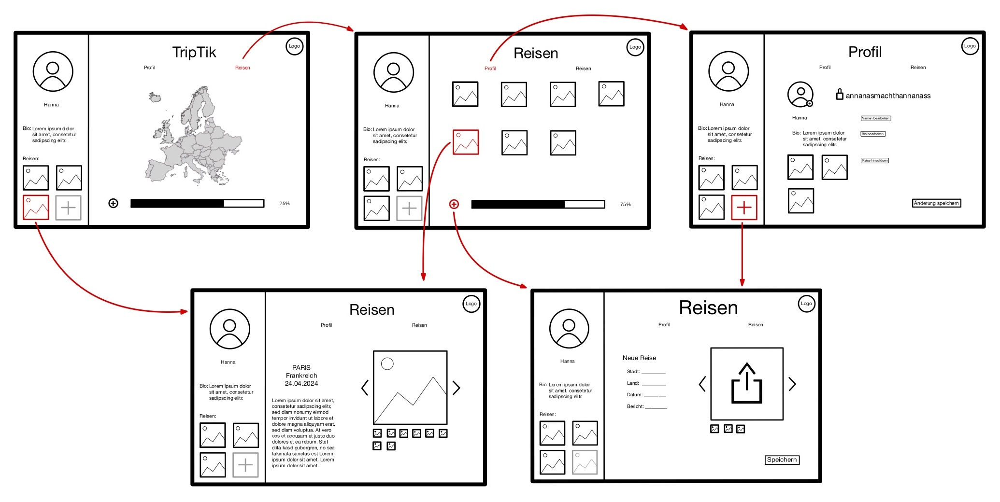

{: .no_toc }
# Value proposition

{: .text-delta }

Table of contents

+ ToC
{: toc }

## Das Problem

Viele Menschen haben nach ihren Reisen das Problem, dass hinterher der normale Alltag sofort wieder weitergeht. So hat man keine Zeit mehr, seine Reiseerinnerungen zu organisieren. Dadurch fehlt ihnen auch die Übersicht über ihre besuchten Orte. Zudem sind viele bekannte Methoden wie das erstellen von Blogs, Fotobüchern oder Videofilemen / Vlogs oft zeitaufwendig. Es fehlen die Interaktivität und der Spaß bei der Reisedokumentation.

## Unsere Lösung

Unsere App bietet die Möglichkeit, übersichtlich alle besuchten Orte auf einen Blick auf einer Landkarte zu sehen. Dazu gibt es einen Progress-Bar, der einem zeigt, wie viel Prozent der Welt man schon bereist hat. Um Länder auf der Landkarte hinzuzufügen, erstellt man einen Reisebericht. Dieser kann kurz und knapp oder ganz ausführlich sein, mit der Möglichkeit, Bilder und Text hinzuzufügen.

## Zielgruppe

### Persona – Arman

User
: Arman, 26 Jahre, begeisterter Reisender, der alle 195 Länder erkunden möchte. Er ist als Freelance-Fotograf fast dauerhaft auf Reisen.

Need
: Er möchte seine Reisen lebendig erhalten, um sie später seiner Familie zu präsentieren. Zudem hat er so die Möglichkeit, all seine vergangenen Reisen und Abenteuer strukturiert dargestellt zu haben. Da er auf Social-Media immer alles auch potenziellen neuen Kunden präsentiert und eine große Reichweite hat, möchte er seine Reisen für sich privat reflektieren können.

Insight
: Er möchte in einer Anwendung auf einen Blick eine Übersicht über seine Reisen haben, seine Erinnerungen organisieren und sehen, wie nah er seinem Ziel, alle Länder zu bereisen, ist.

### Persona – Maria

User
: Maria, 22 Jahre, Studentin, die ihre Semesterferien dazu nutzt, die Welt zu erkunden. Sie macht gerne längere Backpacking-Trips.

Need
: Sie möchte nach ihren langen Trips nicht nach Hause kommen und alles vergessen. Für sie ist es wichtig, schon während der Reise Berichte zu schreiben und ihre Fotos zuzufügen.

Insight
: Sie möchte ihre Reisen für sich selbst dokumentieren und nach dem Backpacking-Trip übersichtlich ihre Erinnerungen sehen. Zudem möchte sie eine Übersicht über ihre bereisten Länder haben, um möglichst verschiedene Orte und Kulturen kennen zu lernen.

## Ablaufdiagramm

